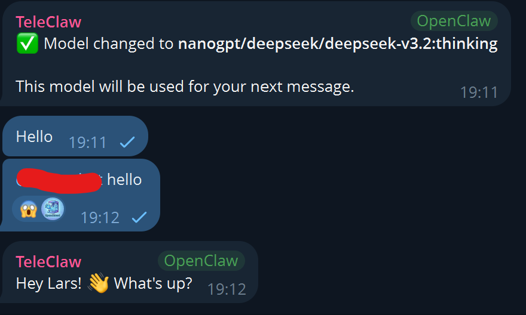
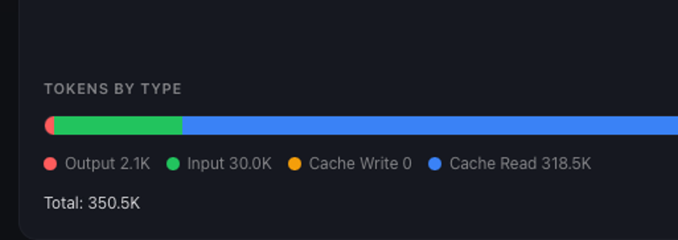

# NanoGPT Provider for OpenClaw

Unofficial NanoGPT provider plugin for OpenClaw.
It adds:

- NanoGPT text model discovery and inference
- automatic subscription vs pay-as-you-go routing for text models
- optional OpenAI Responses transport
- NanoGPT-backed `web_search`
- NanoGPT-backed image generation and image editing
- NanoGPT subscription usage snapshots via OpenClaw's provider-usage surface

## What works today

- text model catalog + inference transport via NanoGPT
- automatic subscription vs pay-as-you-go request routing for text models
- opt-in OpenAI Responses transport for text models
- NanoGPT-backed `web_search`
- NanoGPT-backed image generation and image editing
- daily/monthly NanoGPT subscription quota snapshots exposed to OpenClaw

## Current limitations

- no exhaustive official NanoGPT image-model discovery yet
- no authoritative weekly token accounting from the documented NanoGPT API
- pricing is aligned for a configured upstream provider only when NanoGPT
  exposes provider-selection pricing for that model

NanoGPT's documented usage endpoint reports quota windows, not true token
usage. The plugin exposes those daily/monthly quota snapshots to OpenClaw, but
it does not reconstruct token counts from them.

## Screenshots



## Install

### Local install from a checkout

This is the most practical path right now.

```bash
cd ~/Github
git clone git@github.com:deadronos/nanogpt-provider-openclaw.git
openclaw plugins install ~/Github/nanogpt-provider-openclaw
openclaw gateway restart
```

### Install from a tarball

```bash
npm pack
openclaw plugins install ./deadronos-openclaw-nanogpt-provider-0.1.0.tgz
openclaw gateway restart
```

### npm install

The README previously mentioned direct npm installation, but that publish flow is
not the primary path yet. If you do publish, the release commands are listed in
the development section below.

## Authentication and setup

Set a NanoGPT API key:

```bash
export NANOGPT_API_KEY=your_key_here
```

You can then onboard directly:

```bash
openclaw onboard --nanogpt-api-key your_key_here
```

Or add it to an existing OpenClaw setup:

```bash
openclaw configure
```

Choose **Models** and then **NanoGPT** as the provider. OpenClaw will prompt
for the API key, autodiscover the NanoGPT catalog, and let you select from the
available text models.

The same key is used for:

- text model access
- NanoGPT web search
- NanoGPT image generation

The plugin reads `NANOGPT_API_KEY` by default. Web search can also use a
dedicated config credential path described below.

## Text provider configuration

The plugin config controls NanoGPT text-model discovery and transport behavior:

```json5
{
  plugins: {
    entries: {
      nanogpt: {
        enabled: true,
        config: {
          routingMode: "auto",
          catalogSource: "auto",
          requestApi: "responses",
          provider: "openrouter"
        }
      }
    }
  }
}
```

## Model Allowlist in openclaw.json

For example:

```json5
"agents":{
  "defaults":{
    "models": {
        "nanogpt/moonshotai/kimi-k2.5:thinking": {},
        "nanogpt/minimax/minimax-m2.7": {},
        "nanogpt/deepseek/deepseek-v3.2:thinking": {},
        "nanogpt/mistralai/devstral-2-123b-instruct-2512": {},
        "nanogpt/google/gemma-4-26b-a4b-it:thinking": {},
        "nanogpt/google/gemma-4-31b-it:thinking": {},
        "nanogpt/zai-org/glm-5:thinking": {},
        "nanogpt/zai-org/glm-5": {},
        "nanogpt/moonshotai/kimi-k2.5": {},
        "nanogpt/mistralai/mistral-large-3-675b-instruct-2512": {},
        "nanogpt/nvidia/nemotron-3-super-120b-a12b:thinking": {},
        "nanogpt/qwen/qwen3.5-397b-a17b-thinking": {},
        "nanogpt/qwen/qwen3.5-397b-a17b": {},
        "nanogpt/stepfun-ai/step-3.5-flash": {},
        "nanogpt/stepfun-ai/step-3.5-flash-2603": {}
      }
  }
}
"
```

### Options

- `routingMode`: `auto`, `subscription`, `paygo`
- `catalogSource`: `auto`, `canonical`, `subscription`, `paid`, `personalized`
- `requestApi`: `auto`, `responses`, `completions`
- `provider`: optional NanoGPT upstream provider id

### Behavior notes

- `routingMode: "auto"` probes NanoGPT subscription status and falls back to
  `subscription` if the probe is ambiguous or fails. It only resolves to
  `paygo` when the probe succeeds and explicitly indicates the key is not
  subscription-active.
- `catalogSource: "auto"` resolves to `subscription` when text requests are
  routed through subscription mode, otherwise `canonical`.
- `requestApi: "responses"` uses OpenAI Responses transport (experimental, requires models compatible with Responses API).
- `requestApi: "completions"` keeps OpenAI Chat Completions transport.
- `requestApi: "auto"` defaults to Completions for broader model compatibility; set to `"responses"` explicitly if your models support the Responses API.
- Completions-mode models are still marked with streaming usage compatibility so
  OpenClaw requests `stream_options.include_usage` automatically.
- `moonshotai/kimi-k2.5` and `moonshotai/kimi-k2.5:thinking` keep tool support
  enabled, but the plugin aliases OpenClaw's `web_fetch` tool to
  `fetch_web_page` for those two model ids. Live NanoGPT checks showed the exact
  `web_fetch` tool name could trigger billing-limit/timeout failures on the
  post-tool follow-up, while the aliased tool name completed normally.
- `provider` adds NanoGPT's `X-Provider` override header for text requests.
- if `provider` is set while the request would otherwise use subscription
  routing, the plugin also sets `X-Billing-Mode: paygo`
- `requestApi: "responses"` on subscription routing uses NanoGPT's base API
  endpoint (`/api/v1`) rather than the subscription completions endpoint, so
  treat it as a separate compatibility/billing path from standard subscription
  chat-completions routing.

### Pricing behavior

By default, the plugin exposes pricing from NanoGPT's detailed model catalog.

When `provider` is set, the plugin also tries to align exposed `models[].cost`
with NanoGPT's provider-selection pricing endpoint so the model cost shown to
OpenClaw better reflects the billed price for the selected upstream provider.

If NanoGPT does not expose provider-selection pricing for a model, the plugin
falls back to the default catalog pricing instead of failing model discovery.

## Web search

The plugin registers a NanoGPT-backed `web_search` provider using NanoGPT's
direct `POST /api/web` endpoint.

### Current search behavior

- endpoint: `POST https://nano-gpt.com/api/web`
- fixed upstream settings:
  - `provider: "linkup"`
  - `depth: "standard"`
  - `outputType: "searchResults"`
- supported tool parameters:
  - `query` required
  - `count` optional, clamped to `1-10`
  - `includeDomains` optional
  - `excludeDomains` optional

### Credential resolution

Web search resolves credentials in this order:

- `plugins.entries.nanogpt.config.webSearch.apiKey`
- `NANOGPT_API_KEY`

`plugins.entries.nanogpt.config.webSearch.apiKey` is the web-search provider's
credential storage path, not part of the top-level NanoGPT text-provider config
schema shown above.

## Image generation

The plugin registers a NanoGPT image generation provider backed by:

- `POST https://nano-gpt.com/v1/images/generations`

### Current curated image models

- `hidream`
- `chroma`
- `z-image-turbo`
- `qwen-image-2512`

The default image model is `hidream`.

### Current image capabilities

- generation and edit flows are enabled
- `count` up to `4`
- up to `4` input images for edit flows
- supported sizes: `256x256`, `512x512`, `1024x1024`
- response handling expects `b64_json`

### Model aliases

The provider normalizes friendly subscription labels to curated NanoGPT ids. For
example:

- `HIDREAM` -> `hidream`
- `CHROMA` -> `chroma`
- `Z IMAGE TURBO` -> `z-image-turbo`
- `QWEN IMAGE` -> `qwen-image-2512`

If NanoGPT rejects an image model id, the provider returns an error that points
back to the curated model list and these accepted aliases.

### Notes on current mappings

- `hidream` and `chroma` are straightforward mappings
- `z-image-turbo` and `qwen-image-2512` are the best current API-id mappings
  for the subscription-included labels `Z IMAGE TURBO` and `QWEN IMAGE` based
  on NanoGPT's public surfaces

## Usage reporting

The plugin implements NanoGPT usage reporting through OpenClaw's supported
provider-usage hooks.

Today that means:

- subscription active/inactive state
- daily quota window percentage + reset time
- monthly quota window percentage + reset time

It does **not** currently provide authoritative token accounting for NanoGPT's
weekly token allowances because the documented NanoGPT usage payload does not
expose that data directly.

## Development

### Verify locally

```bash
npm test
npm run typecheck
```

### Publish workflow

```bash
npm test
npm run typecheck
npm pack --dry-run
npm publish --access public
```

## Future improvements

- official image-model discovery if NanoGPT documents a stable catalog surface
- richer pricing and provider-selection UX if OpenClaw adds broader pricing
  display surfaces
- better token-usage accounting if NanoGPT exposes authoritative weekly token
  telemetry

## Token usage accounting notes


